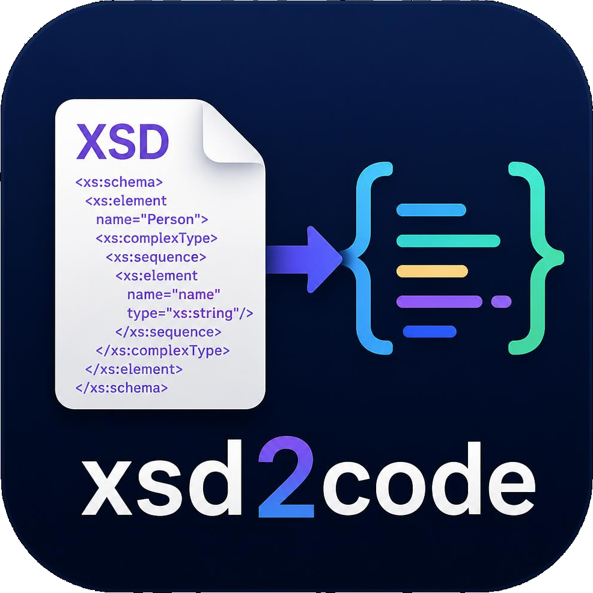

# xsd2code-go

[](https://github.com/chriswirz/xsd2code-go/actions/workflows/release.yml)



Turns XML Schema documents into data classes for **C#**, **Java**, **Go**,
**Kotlin**, **Swift**, **TypeScript**, **JavaScript**, **Python**, **Rust** and
**C++** - and infers a
schema from a pile of example XML documents, or from a live **PostgreSQL**
database.

The generated classes are plain data: fields, no behaviour, and whatever
annotations the language's standard XML binding wants, so deserializing a
document is one call. They are also mapped for Postgres - the same run emits
`schema.sql` and puts the persistence annotations on the same classes, so one
object model serves both the wire format and the database.

```
xsd2code-go generate --lang csharp --namespace Contoso.Orders --out ./gen order.xsd
xsd2code-go generate --lang python --out ./orders order.xsd

xsd2code-go infer --out order.xsd samples/
xsd2code-go infer --database "postgres://localhost/orders" --out db.xsd
```

## Install

### Download a binary

Every push to `main` publishes binaries for Windows, Linux and macOS on amd64
and arm64, plus Linux packages. Grab the latest from the
[releases page](https://github.com/chriswirz/xsd2code-go/releases/latest), or:

```sh
# Linux or macOS: pick your platform and architecture
VERSION=$(curl -fsSL https://api.github.com/repos/chriswirz/xsd2code-go/releases/latest \
  | grep -m1 '"tag_name"' | cut -d'"' -f4)
OS=$(uname -s | tr 'A-Z' 'a-z')          # linux or darwin
ARCH=$(uname -m | sed 's/x86_64/amd64/;s/aarch64/arm64/')

curl -fsSLo xsd2code-go \
  "https://github.com/chriswirz/xsd2code-go/releases/download/${VERSION}/xsd2code-go-${OS}-${ARCH}"
chmod +x xsd2code-go
sudo mv xsd2code-go /usr/local/bin/
```

```powershell
# Windows
$version = (Invoke-RestMethod https://api.github.com/repos/chriswirz/xsd2code-go/releases/latest).tag_name
Invoke-WebRequest -OutFile xsd2code-go.exe `
  "https://github.com/chriswirz/xsd2code-go/releases/download/$version/xsd2code-go-windows-amd64.exe"
```

Every release carries a `SHA256SUMS` file; verify with
`sha256sum -c SHA256SUMS --ignore-missing`.

### Linux packages

`.deb` and `.rpm` packages for amd64 and arm64 are published with each release.
They install the binary to `/usr/bin/xsd2code-go`, the man page, and an example
schema and document under `/usr/share/doc/xsd2code-go/examples/`.

```sh
sudo dpkg -i xsd2code-go_0.1.0001_amd64.deb     # Debian, Ubuntu
sudo rpm -i  xsd2code-go-0.1.0001.x86_64.rpm    # Fedora, RHEL, SUSE

man xsd2code-go
xsd2code-go generate --lang go /usr/share/doc/xsd2code-go/examples/purchaseorder.xsd
```

### With Go

```sh
go install github.com/chriswirz/xsd2code-go/cmd/xsd2code-go@latest
```

### From source

```sh
git clone https://github.com/chriswirz/xsd2code-go
cd xsd2code-go
./build.sh          # or .\build.ps1, or `build` from cmd.exe
```

## Documentation

`xsd2code-go help` prints an overview; `xsd2code-go help generate` and
`xsd2code-go help infer` print each command's flags along with the mapping
tables. The packages install a full **man page**: `man xsd2code-go`. Reading it
from a source checkout works too:

```sh
man ./man/xsd2code-go.1
```

## generate

```
xsd2code-go generate [flags] <schema.xsd>...
xsd2code-go generate [flags] --database <dsn>

  --lang string           go, csharp, java, kotlin, swift, typescript,
                          javascript, python, rust, cpp
  --out string            directory to write the generated files into (default ".")
  --package string        Go/Java/Rust package, or JS/TS module name
  --namespace string      C# or C++ namespace (alias for --package)
  --postgres              add Postgres mapping and emit schema.sql (default true)
  --table-prefix string   prefix for every generated table name
  --ixmlserializable      C# only: implement IXmlSerializable instead of
                          relying on XmlSerializer (see below)
  --stdout                write to standard output instead of files
  --database string       read the model from a PostgreSQL database
```

`xs:include` and `xs:import` are followed from disk, relative to the importing
document. An import whose schema is not present - `xlink`, `xhtml`, an internal
registry - is reported and its types become strings, rather than failing the
run. Nothing is fetched over the network.

### What each language gets

| Language | Files | Bound with | Needs |
| --- | --- | --- | --- |
| `go` | `models.go`, `xsdtypes.go` | `encoding/xml`, plus `json` and `db` tags | nothing |
| `python` | `models.py` | dataclasses over `ElementTree` | nothing |
| `csharp` | `Models.cs`, `<Namespace>DbContext.cs` | `XmlSerializer`, EF Core annotations | EF Core, Npgsql |
| `csharp --ixmlserializable` | the same files | generated `IXmlSerializable` readers and writers, EF Core annotations | EF Core, Npgsql |
| `java` | one `.java` per type | JAXB (`jakarta.xml.bind`), JPA | jakarta.xml.bind, jakarta.persistence |
| `kotlin` | `Models.kt` in the package | data classes over the JDK's DOM | nothing beyond the JDK |
| `swift` | `Models.swift` | structs over `XMLParser` | nothing |
| `typescript` | `models.ts` | readers over the DOM | a DOM |
| `javascript` | `models.js`, `models.d.ts` | the same, typed by declaration | a DOM |
| `rust` | `models.rs` | serde with quick-xml | serde, quick-xml |
| `cpp` | `models.hpp`, `models.cpp` | pugixml | pugixml |

Every generated file names its own dependencies in a header comment. In the
browser TypeScript and JavaScript need nothing; on the server, register a DOM
once:

```js
import { DOMParser } from "@xmldom/xmldom";
globalThis.DOMParser = DOMParser;
```

### Writing a document

Every language's entry points come in a matching pair: read a document, and
write one. In C#:

```csharp
var order = XmlDocuments.LoadPurchaseOrder("po.xml");
order.Comment = "leave it by the gate";

string xml = XmlDocuments.ToXmlPurchaseOrder(order);   // as text
XmlDocuments.SavePurchaseOrder("po-out.xml", order);   // to a path
```

`WritePurchaseOrder` is there too, taking either a `Stream` or an `XmlWriter`
the caller already owns. The text is indented and carries no byte order mark,
so the string and the file agree with the UTF-8 the declaration announces.

### C# without reflection

`--ixmlserializable` emits the same classes, with the same members, reading and
writing themselves through `IXmlSerializable` instead of being described to
`XmlSerializer` by attribute:

```
xsd2code-go generate --lang csharp --ixmlserializable --namespace Contoso.Orders order.xsd
```

`XmlSerializer` reflects over a type the first time it sees it and emits an
assembly to do the work. That costs a pause on the first document, and it is
why the attribute-based output cannot be published with trimming or NativeAOT
without warnings. The generated members name every property directly, so the
whole path is ordinary compiled code: `XmlReader` and `XmlWriter`, a `switch`
per element name, and a generated converter per enumeration.

What the format handles for itself, rather than through `XmlSerializer`:

| Feature | How |
| --- | --- |
| inheritance | `ReadXmlElement`, `WriteXmlElements` and their siblings are virtual; a derived type overrides them and calls `base` |
| `xsi:type` | a generated factory per base type creates the derivation the document names, and an instance writes its own type when it stands in for its base |
| `xsi:nil` | read and written for a nillable element |
| enumerations | a generated `Parse`/`Format` pair over the lexical values, not a lookup through `XmlEnumAttribute` |
| `xs:list` | split and joined in generated code; the string companion property the attribute format needs is gone |
| `any`, `anyAttribute` | kept as `XmlElement[]` and `XmlAttribute[]`, written back as they arrived |
| `xs:date`, `xs:time`, `xs:hexBinary` | written in their own lexical form, which `XmlSerializer` gets wrong for `xs:date` |

The classes keep the same shape in both formats - same names, same types, same
`Specified` companions - so switching is a regeneration, not a rewrite of the
calling code. The Entity Framework mapping is emitted either way.

Reading a document, in each language:

Golang
```go
order, err := orders.LoadPurchaseOrder("po.xml")
```

Python
```python
order = models.load_purchase_order("po.xml")
```

C-Sharp
```csharp
var order = XmlDocuments.LoadPurchaseOrder("po.xml");
```

Java
```java
PurchaseOrderType order = XmlDocuments.loadPurchaseOrder(new File("po.xml"));
```

Kotlin
```kotlin
val order = loadPurchaseOrder(File("po.xml"))
```

Swift
```swift
let order = try loadPurchaseOrder(contentsOf: url)
```

Typescript
```ts
const order = parsePurchaseOrder(await file.text());
```

Rust
```rust
let order = parse_purchase_order(&xml)?;
```

C++
```cpp
const auto order = orders::load_purchase_order("po.xml");
```

### How the schema is mapped

| XSD | Generated |
| --- | --- |
| `complexType` | a class |
| `complexContent`/`extension` | inheritance - the base keeps its own fields, except in Kotlin, Swift and Rust, whose types cannot inherit, where they are written into each derived type |
| `complexContent`/`restriction` | a flattened standalone class (see below) |
| `simpleContent` | a `Value` member plus the attributes |
| `simpleType` with `enumeration` | an enum carrying each XML lexical value |
| any other `simpleType` | the primitive it ultimately restricts |
| `group`, `attributeGroup` | expanded inline at the point of reference |
| `choice` | ordinary optional members, documented as mutually exclusive |
| `minOccurs="0"` | nullable: a pointer in Go, a boxed type in Java, `T?` in C# - except on an attribute, where XmlSerializer refuses `Nullable<T>` and a `Specified` companion carries absence instead; C# keeps that shape under `--ixmlserializable` too, so the two formats stay interchangeable |
| `maxOccurs > 1` | a collection, never also nullable |
| `list` | one element or attribute split on whitespace |
| `any`, `anyAttribute` | kept as raw XML and as name/value pairs |
| anonymous inline types | a class named for the element that owns it |

Two decisions worth knowing about:

- **A restriction is flattened, not subclassed.** A restriction removes members
  from its base, and no target language has a way to say that. XSD requires a
  restriction to restate the content it keeps, so its own body is the complete
  content model and generating it standalone loses nothing.
- **A choice becomes optional members, not a union.** Modelling it faithfully
  would cost the plain-object shape that makes deserialization one call. The
  members are tagged in the doc comment instead, so the constraint is visible
  where someone would look for it.

Anything approximated is printed as a warning at generation time.

### Postgres

With `--postgres` (on by default) the same run emits `schema.sql` and annotates
the classes to match it:

- One table per class, plus a surrogate `id`. XML documents carry no dependable
  identity of their own, so persistence needs a key of its own; it is excluded
  from serialization. A model read from a database keeps its own key instead.
- **Inheritance is joined-table**: a derived type's primary key is also a foreign
  key onto its base, so a query against the base sees every descendant. That is
  EF Core's TPT and JPA's `JOINED`, and it is what the DDL creates.
- A single-valued complex member becomes a foreign key column.
- A **repeated** complex member becomes a link table with an `ordinal` column.
  Document order is data, and a set of rows has no order at all. A link table
  rather than a back-pointer, because the same complex type is routinely
  reachable from several parents.
- A repeated primitive or an `xs:list` becomes a Postgres array.
- An enum becomes `text` with a `CHECK` constraint - not a Postgres enum type,
  which every ORM maps differently and which cannot be altered freely.
- Every foreign key is added as a separate `ALTER TABLE` after the tables, so a
  recursive schema - an element that contains itself is ordinary - has no
  ordering problem.
- The schema's own documentation is carried into `COMMENT ON` statements, so
  `\d+` says what the column meant in the XML.

```
psql -f schema.sql
```

## infer

```
xsd2code-go infer [flags] <document.xml|directory>...
xsd2code-go infer [flags] --database <dsn>

  --out string                file to write the schema to (default: stdout)
  --target-namespace string   target namespace for the schema
  --max-enum int              at most this many distinct values is an enum (default 12)
  --min-enum-samples int      values needed before an enum is inferred (default 8)
  --strings                   give every value xs:string, inferring nothing
  --database string           describe a PostgreSQL database instead of documents
  --db-schema string          the Postgres schema to read (default "public")
  --db-views                  include views and materialized views
  --db-keys                   keep generated surrogate keys as content
```

### From documents

A directory argument means every `.xml` file in it. Globs are expanded by the
tool itself, so `samples/*.xml` works on Windows too.

- **Structure** is merged by element name, so an element that appears in three
  places produces one type, not three.
- **minOccurs** is 0 unless the child appeared in every instance of its parent;
  **maxOccurs** is `unbounded` if any single parent held more than one.
  Attributes are `required` only if present on every occurrence.
- **Order** stays an `xs:sequence` as long as every document's children are a
  subsequence of the order first seen. Two documents that genuinely disagree
  produce a repeated `xs:choice`, which accepts any interleaving.
- **Datatypes** are inferred subtractively: a type stays a candidate until a
  value rules it out, so one `N/A` in a column of numbers correctly demotes the
  whole field to a string. `0` and `1` are integers unless something spelled out
  `true` or `false`.
- **Enumerations** need repetition, not just few values: a field whose every
  value is distinct is an identifier, and is left alone.

The result describes the samples, not the format. It says so in its own header
comment, and it is meant to be read and edited before it is treated as a
contract.

### From a database

```sh
xsd2code-go infer --database "postgres://user@localhost/orders" --out db.xsd

# or straight to code, with no schema file in between
xsd2code-go generate --lang java --package com.acme.orders \
  --database "host=db.internal dbname=orders" --out ./src
```

`--database` takes a URL or libpq keyword/value pairs. `PGPASSWORD`, `PGSERVICE`
and `~/.pgpass` are honoured, so a password need never appear on the command
line, where it would be visible to every other process on the machine and
recorded in your shell history.

- One complex type per table, named after it.
- A single-column **foreign key** becomes nested content: the row it points at,
  in place. Multi-column keys stay ordinary values - there is no sensible
  reading of one as a single element.
- A **link table** - two foreign keys and nothing else but an ordinal - becomes
  repeated content on the parent.
- An **array column** becomes a repeated value.
- A **CHECK constraint** pinning a column to a fixed set, or a Postgres enum
  type, becomes an enumeration.
- **Table and column comments** become `xs:documentation`.
- Generated surrogate keys are dropped, since they describe the storage rather
  than the document; `--db-keys` keeps them.
- A table whose single-column **primary key is also a foreign key** onto another
  table's key is a joined-table subclass, and becomes an `xs:extension` of it.
- Tables that nothing references are declared as the document roots.

What a relational schema cannot tell you, it does not guess: nothing records
which values were attributes, which were child elements, and which were an
element's own text content, so everything comes back as an element. A schema
taken through `generate` and back is equivalent in structure, not identical in
spelling.

A model read this way keeps the names it found - the table, the columns and the
primary key - so code generated from a database binds to that database rather
than to a re-derived guess at it.

## Building

```
./build.sh          # Linux, macOS, Git Bash
.\build.ps1         # PowerShell
build               # cmd.exe, which runs build.ps1

go test ./...
```

The scripts stamp `0.1.0000-dev`, plus the short commit when there is one, so a
binary's `version` output alone says whether it came from CI. `go build
./cmd/xsd2code-go` works too; it just leaves the version at `dev`.

The test suite includes an end-to-end test that writes the generated Go package
to a temporary module, compiles it, and unmarshals a real document with it -
the only kind of test that proves the output works rather than merely looks
right.

CI does that for **every** language, in a job of its own, against the fixture
schema:

| Job | What it proves |
| --- | --- |
| `test` | gofmt, `go vet`, the whole unit suite, and that no source directory is excluded by `.gitignore` |
| `golang` | the generated package builds as its own dependency-free module and parses the sample |
| `csharp` | a matrix over both formats: the output is in the format that was asked for, compiles, parses the sample, writes it back as text and to a file and re-reads both, and the EF Core model builds |
| `kotlin` | it compiles with kotlinc and parses the sample |
| `swift` | it builds as a SwiftPM package and parses the sample |
| `java` | it compiles against JAXB and JPA, and parses the sample |
| `typescript` | `tsc --strict` accepts it; the JavaScript build parses the sample under Node |
| `python` | it parses the sample on CPython 3.12 |
| `rust` | `cargo test` parses the sample through serde and quick-xml |
| `cpp` | it compiles with g++ against pugixml and parses the sample |
| `postgres` | the DDL applies to a real server, the schema reads back out of it, and code generates from what came back |

Compiling alone turned out to be too weak a check: `XmlSerializer` rejects
several shapes that compile perfectly well, and an EF Core mapping is only
validated when the model is built. Every job therefore runs the generated code,
not merely builds it.

## Layout

```
cmd/xsd2code-go   the command line
internal/xsd      parses schema documents into a faithful tree
internal/ir       resolves that tree into a language-neutral model, and its
                  relational mapping
internal/gen      emits each language, and the Postgres DDL
internal/infer    derives a schema from example documents
internal/pgintro  describes a live PostgreSQL database as the same model
internal/xsdout   writes a model back out as a schema document
man/              the man page
packaging/        the nfpm config for the .deb and .rpm
```

Everything awkward about XSD - anonymous types, extension chains, group and
attribute-group references, occurrence ranges - is resolved once in
`internal/ir`, so each generator is a straightforward walk over classes and
fields, and a model built from a database gets all eight languages for free.
